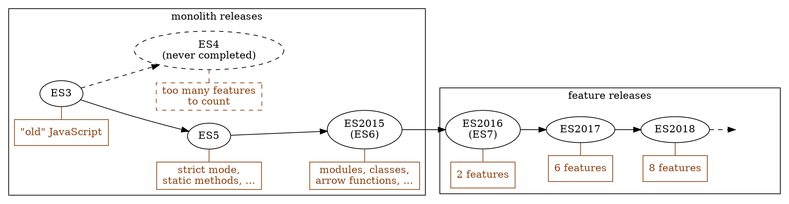
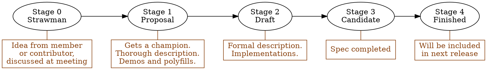
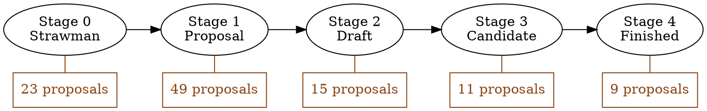

The **ECMASCript versions**:

```dot
digraph {

  rankdir = LR;
  bgcolor = transparent

  subgraph cluster_monolith {
    # EC2 [label="", color=transparent]
    #EC2 -> EC3
    label = "monolith releases"
    EC3 [label="ES3"]
    EC4 [label="ES4\n(never completed)", style=dashed]
    EC5 [label="ES5"]
    EC6 [label="ES2015\n(ES6)"]
    EC3 -> EC4 [style=dashed]
    EC3 -> EC5 -> EC6


    EC3desc -> EC3 [color=chocolate4 arrowhead=none]
    EC4desc -> EC4 [color=chocolate4 arrowhead=none, style=dashed]
    EC5desc -> EC5 [color=chocolate4 arrowhead=none]
    EC6desc -> EC6 [color=chocolate4 arrowhead=none]


    EC3desc [shape=box color=chocolate4 fontcolor=chocolate4 label="\"old\" JavaScript"]
    EC4desc [shape=box color=chocolate4 fontcolor=chocolate4 label="too many features\nto count", style=dashed]
    EC5desc [shape=box color=chocolate4 fontcolor=chocolate4 label="strict mode,\nstatic methods, ..."]
    EC6desc [shape=box color=chocolate4 fontcolor=chocolate4 label="modules, classes,\narrow functions, ..."]

    {rank=same; EC3, EC3desc}
    {rank=same; EC4, EC4desc}
    {rank=same; EC5, EC5desc}
    {rank=same; EC6, EC6desc}
  }

  subgraph cluster_feature {
    label = "feature releases"
    EC7 [label="ES2016\n(ES7)"]
    EC8 [label="ES2017"]
    EC9 [label="ES2018"]
    EC10 [label=".", style=dashed, color=transparent, fontcolor=transparent]
    EC7 -> EC8 -> EC9
    EC9 -> EC10 [style=dashed]

    EC7desc [label="2 features" shape=box color=chocolate4 fontcolor=chocolate4]
    EC8desc [label="6 features" shape=box color=chocolate4 fontcolor=chocolate4]
    EC9desc [label="8 features" shape=box color=chocolate4 fontcolor=chocolate4]

    EC7desc -> EC7 [arrowhead=none color=chocolate4]
    EC8desc -> EC8 [arrowhead=none color=chocolate4]
    EC9desc -> EC9 [arrowhead=none color=chocolate4]

    {rank=same; EC7, EC7desc}
    {rank=same; EC8, EC8desc}
    {rank=same; EC9, EC9desc}
  }

  EC6 -> EC7
}
```

~~

The **TC39 process**:

```dot
digraph {
  rankdir = LR;
  bgcolor = transparent;

  stage0 [label="Stage 0\nStrawman"]
  stage0 -> stage0desc [arrowhead=none color=chocolate4]
  stage0desc [shape=rectangle, color=chocolate4 fontcolor=chocolate4 label="Idea from member\nor contributor,\ndiscussed at meeting"]
  {rank=same; stage0, stage0desc}

  stage1 [label="Stage 1\nProposal"]
  stage1 -> stage1desc [arrowhead=none color=chocolate4]
  stage1desc [shape=rectangle, color=chocolate4 fontcolor=chocolate4 label="Gets a champion.\nThorough description.\nDemos and polyfills."]
  {rank=same; stage1, stage1desc}

  stage2 [label="Stage 2\nDraft"]
  stage2 -> stage2desc [arrowhead=none color=chocolate4]
  stage2desc [shape=rectangle, color=chocolate4 fontcolor=chocolate4 label="Formal description.\nImplementations."]
  {rank=same; stage2, stage2desc}

  stage3 [label="Stage 3\nCandidate"]
  stage3 -> stage3desc [arrowhead=none color=chocolate4]
  stage3desc [shape=rectangle, color=chocolate4 fontcolor=chocolate4 label="Spec completed"]
  {rank=same; stage3, stage3desc}

  stage4 [label="Stage 4\nFinished"]
  stage4 -> stage4desc [arrowhead=none color=chocolate4]
  stage4desc [shape=rectangle, color=chocolate4 fontcolor=chocolate4 label="Will be included\nin next release"]
  {rank=same; stage4, stage4desc}

  stage0 -> stage1 -> stage2 -> stage3 -> stage4
}
```

~~

Current **proposal count** (as of 2019-05-06):

```dot
digraph {
  rankdir = LR;
  bgcolor = transparent;

  stage0 [label="Stage 0\nStrawman"]
  stage0 -> stage0desc [arrowhead=none color=chocolate4]
  stage0desc [shape=rectangle, color=chocolate4 fontcolor=chocolate4 label="23 proposals"]
  {rank=same; stage0, stage0desc}

  stage1 [label="Stage 1\nProposal"]
  stage1 -> stage1desc [arrowhead=none color=chocolate4]
  stage1desc [shape=rectangle, color=chocolate4 fontcolor=chocolate4 label="49 proposals"]
  {rank=same; stage1, stage1desc}

  stage2 [label="Stage 2\nDraft"]
  stage2 -> stage2desc [arrowhead=none color=chocolate4]
  stage2desc [shape=rectangle, color=chocolate4 fontcolor=chocolate4 label="15 proposals"]
  {rank=same; stage2, stage2desc}

  stage3 [label="Stage 3\nCandidate"]
  stage3 -> stage3desc [arrowhead=none color=chocolate4]
  stage3desc [shape=rectangle, color=chocolate4 fontcolor=chocolate4 label="11 proposals"]
  {rank=same; stage3, stage3desc}

  stage4 [label="Stage 4\nFinished"]
  stage4 -> stage4desc [arrowhead=none color=chocolate4]
  stage4desc [shape=rectangle, color=chocolate4 fontcolor=chocolate4 label="9 proposals"]
  {rank=same; stage4, stage4desc}

  stage0 -> stage1 -> stage2 -> stage3 -> stage4
}
```
