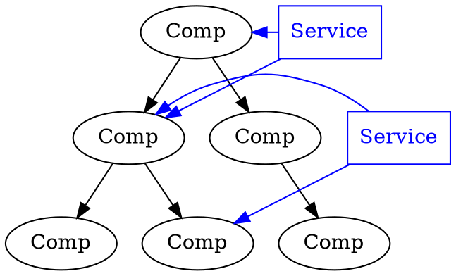

Before:

```dot
digraph {
  rankdir = LR
  bgcolor = transparent
  compound = true

  subgraph cluster_html {
    label = "HTML"
    comp1h [label="Comp1"]
    comp2h [label="Comp2"]
    comp3h [label="Comp3"]
  }

  subgraph cluster_css {
    label = "CSS"
    comp1c [label="Comp1"]
    comp2c [label="Comp2"]
    comp3c [label="Comp3"]
  }

  subgraph cluster_js {
    label = "JavaScript"
    comp1j [label="Comp1"]
    comp2j [label="Comp2"]
    comp3j [label="Comp3"]
  }

  comp1h -> comp1c [color=transparent]
  comp1c -> comp1j [color=transparent]

}
```

~

Now:

```dot
digraph {
  rankdir = TD
  bgcolor = transparent
  compound = true

  subgraph cluster_html {
    label = "Comp1"
    comp1h [label="JS"]
    comp2h [label="CSS"]
    comp3h [label="HTML"]
  }

  subgraph cluster_css {
    label = "Comp2"
    comp1c [label="JS"]
    comp2c [label="CSS"]
    comp3c [label="HTML"]
  }

  subgraph cluster_js {
    label = "Comp3"
    comp1j [label="JS"]
    comp2j [label="CSS"]
    comp3j [label="HTML"]
  }

  comp1h -> comp1c [color=transparent]
  comp1c -> comp1j [color=transparent]

}
```

~

App level:

```dot
digraph {
  rankdir = TD;
  bgcolor = transparent;
  c1, c2, c3, c4, c5, c6 [label="Comp"];
  c1 -> c2
  c1 -> c3
  c2 -> c4
  c2 -> c5
  c3 -> c6
  c3 -> c5 [color=transparent]

}
```

~

Often, **components are the only abstraction**.

RIP MVC

~

Usually there're mechanics for **providing stuff** through generations...

```dot
digraph {
  rankdir = TD;
  bgcolor = transparent;
  c1, c2, c3, c4, c5, c6 [label="Comp"];
  c1 -> c2
  c1 -> c3
  c2 -> c4
  c2 -> c5
  c3 -> c6
  c3 -> c5 [color=transparent]

  c1 -> c4 [color=blue,constraint=none]
  c1 -> c3 [color=blue,constraint=none]
}
```

~

...or an **outside layer** that accomplishes the same thing:



~

Commonly, **rendering is separated** to allow different targets:

```dot
digraph {
  rankdir = LR;
  bgcolor = transparent;
component, renderer [shape=box]
virtual [label="Virtual\nDOM"]
input -> component -> virtual
virtual -> renderer
renderer:e -> DOM:w
renderer:e -> string:w
renderer:e -> other:w
}
```
